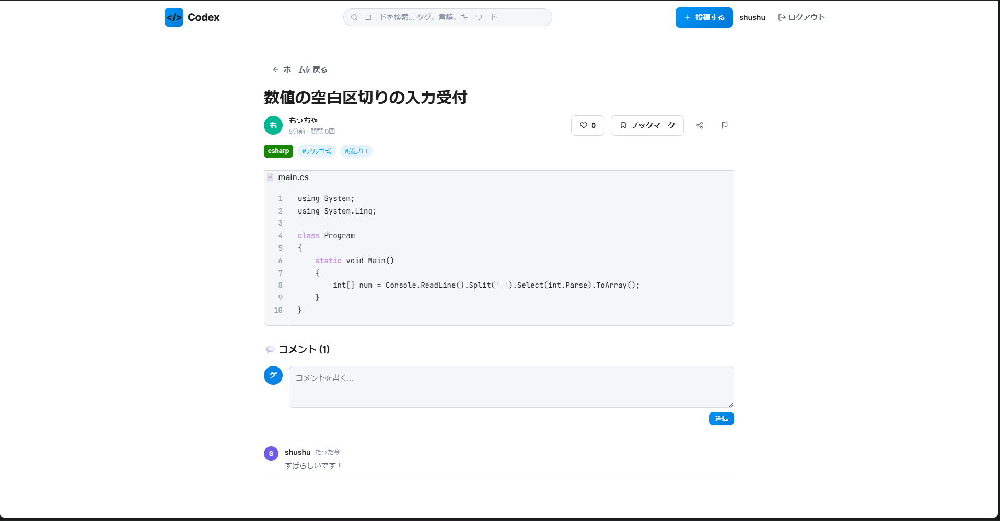

# Codex

エンジニアやプログラミング学習者が、自身が書いたコード（スニペット〜複数ファイルのプロジェクト）を気軽に投稿・共有できるプラットフォームです。閲覧者は多様な言語のコードから学びを得て、いいねやブックマークで作品を評価・管理できます。UI/UX は Pixiv をベンチマークとし、直感的でスムーズな操作性を目指して開発しました。

- **公開 URL:** [https://codeapp-pi.vercel.app/](https://codeapp-pi.vercel.app/)  <!-- ← デプロイ後に差し替え -->
- **GitHub:** [https://github.com/shuei0609/NextApp](https://github.com/shuei0609/NextApp)

---

## 特徴と機能

### 1. 多言語対応コードビューア

シンタックスハイライト付きのコードビューアで、Python・Go・TypeScript・Julia など多様な言語に対応しています。複数ファイルの投稿にも対応しており、タブで切り替えながらコードを閲覧できます。

<!--  -->
> 📷 `docs/screenshots/code_viewer.png` にスクリーンショットを配置してください

### 2. タイムライン（トレンド / 新着 / フォロー中）

トップページには「トレンド」「新着」「フォロー中」の3つのタブがあり、トレンドタブでは「いいね数 × 新しさ」のスコアリングアルゴリズムで話題のコードを自動的に上位表示します。

<!--  -->
> 📷 `image\スクリーンショット 2026-02-23 235234.png`

### 3. ユーザー認証 & プロフィール

メールアドレスとパスワードによる認証機能を実装。ユーザープロフィールではアイコン画像や自己紹介文の設定、投稿コード一覧の表示が可能です。

<!--  -->
> 📷 `image\スクリーンショット 2026-02-23 235530.png` 

### 4. コード投稿機能

タイトル・説明文・タグ・複数のコードファイルを添えて投稿できます。各ファイルごとに言語を指定でき、下書き保存にも対応しています。

<!--  -->
> 📷 `image/スクリーンショット 2026-02-23 235724.png` 

### 5. ソーシャル機能（いいね / ブックマーク / コメント）

投稿に対するいいね・ブックマーク・コメント機能を搭載。いいねはトレンドの順位に影響し、ブックマークは非公開の個人保存として利用できます。

<!--  -->
> 📷 `image/スクリーンショット 2026-02-23 235859.png` 

---

## 使用技術（技術スタック）

### 言語・フレームワーク

| 技術 | バージョン | 用途 |
|------|-----------|------|
| TypeScript | 5 | 型安全な開発全般 |
| Next.js | 16 (App Router) | フロントエンド / バックエンド |
| React | 19 | UI コンポーネント |
| Prisma | 7 | ORM / マイグレーション |

### 主要ライブラリ

| ライブラリ | 用途 |
|-----------|------|
| NextAuth.js v5 | Credentials 認証 |
| Prism.js | シンタックスハイライト |
| bcryptjs | パスワードハッシュ化 |
| react-hot-toast | 通知 UI |
| react-icons | アイコン |

### 開発ツール・サービス

| ツール | 用途 |
|-------|------|
| VS Code | エディタ |
| Supabase | PostgreSQL データベース / ストレージ |
| Vercel | ホスティング / CI/CD |
| GitHub | バージョン管理 |
| GitHub Actions | 定期 Ping (Supabase 停止防止) |

### システム構成図

```
┌─────────────┐       ┌──────────────┐       ┌────────────────┐
│   Browser   │──────▶│   Vercel     │──────▶│   Supabase     │
│  (React 19) │◀──────│  (Next.js)   │◀──────│  (PostgreSQL)  │
└─────────────┘       │              │       └────────────────┘
                      │  App Router  │
                      │  API Routes  │
                      │  NextAuth.js │
                      └──────────────┘
                             ▲
                             │
                      ┌──────────────┐
                      │   GitHub     │
                      │  (main push) │
                      │  CI/CD 連携  │
                      └──────────────┘
```

---

## 開発期間・体制

- **開発体制:** 個人開発
- **開発期間:** 2026.01.xx ~ 2026.02.xx（約 XXX 時間）<!-- ← 実際の値に差し替え -->

---

## 工夫した点・苦労した点

- **Pixiv ライクな UI/UX の追求:** Vanilla CSS でカスタムデザインシステムを構築し、ブルー基調のモダンなデザインを実現。CSS 変数（カスタムプロパティ）を活用して一貫性のあるテーマを維持。
- **Prisma v7 + Supabase の統合:** Prisma v7 で必須となった `@prisma/adapter-pg` を使用して PostgreSQL 接続を構成。SSL 設定や接続プールの設定に苦労したが、安定した接続を実現。
- **Server Components 活用:** Next.js 16 の App Router と Server Components を活用し、DB クエリをサーバサイドで直接実行することで、API を介さず高速なデータ取得を実現。
- **トレンドアルゴリズム:** 「いいね数 × 新しさ」に基づくスコアリングアルゴリズムを自作し、投稿の鮮度と人気度を考慮した表示順を実現。

---

## 既知の課題と今後の展望

### 既知の課題
- GitHub OAuth 連携が未実装
- 投稿の編集・削除機能が未実装
- フォロー中タブのフィルタリングが仮実装

### 今後の展望
- GitHub OAuth によるソーシャルログインの実装
- タグ検索・言語別フィルタリング機能の強化
- 関連コードのレコメンド機能
- 通報・ブロック機能の実装
- PWA 対応によるモバイル体験の向上

---

## ローカル開発

### セットアップ

```bash
# リポジトリをクローン
git clone https://github.com/shuei0609/NextApp.git
cd nextapp

# 依存パッケージのインストール
npm install

# 環境変数の設定
cp .env.example .env.local
# .env.local に DATABASE_URL, DIRECT_URL, NEXTAUTH_SECRET, NEXTAUTH_URL を設定

# Prisma クライアント生成 & DB 同期
npx prisma generate
npx prisma db push

# 開発サーバー起動
npm run dev
```

http://localhost:3000 にアクセスして確認してください。

---

## データベース設計

```
User ──┬── Post ──── CodeFile
       │       ├── Like
       │       ├── Bookmark
       │       └── Comment
       ├── Follow
       ├── Report
       └── Block
```

主要モデル: User, Post, CodeFile, Like, Bookmark, Comment, Follow, Report, Block

## 製作時間

- 2026/02/22 ~ 2026/02/24
- 約20時間